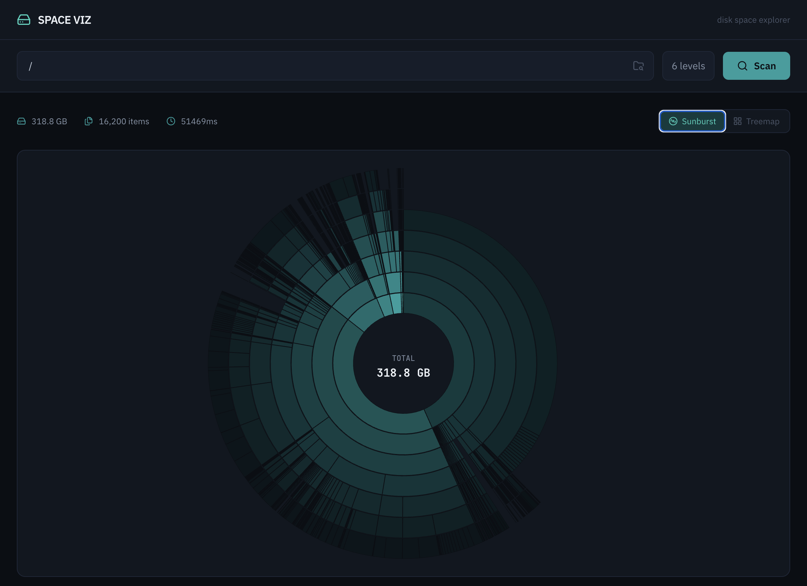
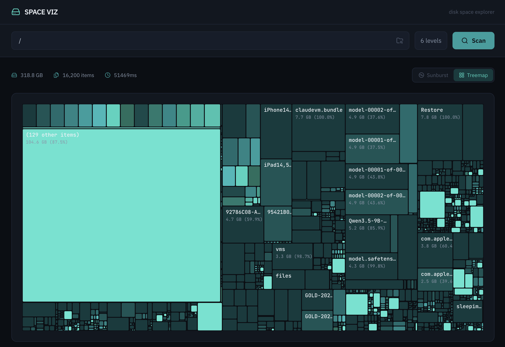
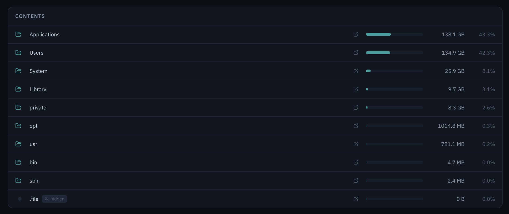

# Space Viz

A local disk space visualization tool built with Next.js, D3, and Recharts. Scan any directory and explore where your storage is going through interactive sunburst and treemap charts.







## Features

- **Sunburst chart** - D3-powered radial visualization with drill-down navigation
- **Treemap chart** - Recharts box layout showing proportional folder sizes
- **Folder browser** - Browse and select directories to scan
- **Reveal in Finder** - Open any folder directly in Finder
- **Hidden file detection** - Scans dot-prefixed and macOS-hidden directories, with badges to indicate visibility
- **Sparse file handling** - Reports actual disk usage, not logical file size (e.g., Docker VM images)
- **APFS firmlink deduplication** - Avoids double-counting on macOS volumes

## Getting started

```bash
pnpm install
pnpm dev
```

Open [http://localhost:3000](http://localhost:3000), enter a directory path (or use the folder browser), and hit Scan.

## Tech stack

- Next.js 16 + React 19 + TypeScript
- D3 (hierarchy, shape, scale, interpolate) for sunburst chart
- Recharts for treemap chart
- Tailwind CSS 4
- Lucide React icons
